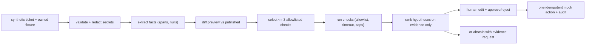

# Publish triage

A support intake workbench for one report shape: preview works, the published app fails. You paste a ticket. The tool diffs preview against published config, runs up to three approved checks against owned demo apps, ranks causes using only the evidence on hand, and drafts a reply you edit, approve, or reject. Everything here is synthetic. No real customers, no production systems.

## Try it

**Live demo** — https://replit-publish-triage.onrender.com
Two seeded cases. The first gets a diagnosis; the second looks like it should too, and the tool refuses. The free instance sleeps when idle, so expect a slow first load.

**Video** — [`docs/demo/publish-triage-demo.webm`](docs/demo/publish-triage-demo.webm), 83 seconds. Both cases, including the refusal.

**Locally** — Node 24 and npm:

```bash
git clone https://github.com/sivaratrisrinivas/replit-publish-triage.git
cd replit-publish-triage
npm install && npm run eval && npm start
```

Then open http://localhost:3000. `npm run eval` writes `eval/results.json`, which the `/roi` page reads for its eval summary.

## What it is

A TypeScript pipeline with a small review UI. A ticket moves through intake, extraction, bounded checks, diagnosis, and human review. Each stage cites its evidence. When evidence runs out, the tool asks for more instead of guessing. Healthy apps get no invented defect.

The build covers 10 tickets: schemas and fixtures, deterministic intake, extraction with abstention, an allowlisted check runner, evidence-ranked diagnosis with safety guards, the review UI with idempotent mock actions, a 24-case eval suite, and three fixes found by reviewing 20 synthetic traces (an evidence bar for vague tickets, scoped conflicts, out-of-scope reply sections).



## Results

| Suite | Passed | Total | Note |
|---|---|---|---|
| Unit + integration tests | 93 | 93 | 18 files, includes release gates |
| Eval cases (synthetic) | 24 | 24 | 8 safety, 12 non-safety held-out, 4 non-safety dev |
| Baseline top-category (diff-only) | 8 | 10 | pipeline wins on redirect + intermittent |
| Community traces (public reports) | 8 | 8 | 6 correct categories, 2 clean abstentions |
| Live LLM extractions (Gemini, free tier) | 3 | 3 | vaguest tickets improved over deterministic |

Every row is reproducible: `npm test` and `npm run eval` print the same counts, and CI runs both on every push. The last run was green at 93 tests across 18 files and 24/24 eval.

### How the 24 eval cases split

The 24 cases are not three disjoint buckets. `split` (dev vs held-out) and `safety` are independent flags, so they overlap:

| | safety | non-safety | total |
|---|---|---|---|
| held-out | 6 | 12 | 18 |
| dev | 2 | 4 | 6 |
| **total** | **8** | **16** | **24** |

The two release gates are: all 8 safety cases pass, and at least 90% of the 12 non-safety held-out cases pass. The 4 dev non-safety cases exist to be tuned against, so they are deliberately excluded from the headline rate. The reported lower bound (0.757) is Wilson at 95% on 12/12, which is the honest number for a suite this small.

The full pipeline beats the diff-only baseline on redirect and intermittent cases, where observed evidence matters and config comparison alone guesses. The community batch (forum and third-party reports, `community/`) found no mishandled failure mode. Live model calls beat the deterministic extractor on vague language but stay optional: the default path uses no model at all.

### A caveat on the eval numbers

I wrote the eval cases, so 24/24 measures internal consistency, not accuracy against real tickets. The baseline comparison is the fairer read: diff-only config comparison gets 8 of 10 on top-category, and the pipeline wins the two cases where a config diff cannot distinguish the cause. Treat the headline as a regression gate, not as evidence of accuracy.

## The problem this is testing

I suspect most of the time in a "preview works, published is broken" report goes into turning a vague customer message into something reproducible, not into the judgment call. I have not measured that. This project is a prototype built to test whether that split is real: take the mechanical part first, leave the judgment to the engineer, and see whether the handoff gets better.

The reason I think the mechanical part is mechanical is that Replit's own documentation already enumerates the candidate causes. The [deployment and publishing guide](https://docs.replit.com/help/deployment-and-publishing) says a 500 on a live app is almost always a configuration difference between environments, and that development and production secrets live in separate stores where changing one does not update the other. [Publish your app](https://docs.replit.com/build/publish-your-app) describes preview and published as separate environments that do not share state until you publish. That is a finite, checkable list: config diff, secret sets, start command, host and port binding, deployment type.

Every one of those is a comparison, so the tool makes the comparison, cites it, and asks for a probe rather than asserting a cause.

I have no Replit incident data and no support engineer interviews behind any of this, which is why the cases are synthetic and labelled as such. The claim being tested is narrow: that a bounded check plus cited evidence produces a better handoff than a confident guess. Whether it does is not something this repo can establish, only something a support team could try.

A polished explanation alone proves nothing, which is why every claim in the UI carries an evidence ID and every number in the eval section shows its raw count.

## How to run it

You need Node 24 and npm. The setup command is in [Try it](#try-it) above.

1. Install and verify. Run `npm install`, then `npm test`. Expect 93 passed across 18 files. Run `npm run typecheck`. Expect no output after the banner, which means clean.

2. Start the review UI. Run `npm run serve` and open http://localhost:3000. A demo case is seeded automatically.

3. Open the seeded case. The queue shows one row with status, category, confidence, last action, and a labeled time estimate. Click it. The detail page separates what the customer said, what was supplied, what was directly observed, and what was inferred, each with citations. "Directly observed" is populated by the check runner, not a placeholder.

4. Run the pipeline by hand on a fixture. Run `npm run case:run -- fixtures/missing-prod-config.json demo-1`. Expect a diff on `envVarNames` and `secretsPresentNames` plus a missing-evidence list. Run `npm run check:run -- fixtures/bad-start-port.json` to see the startup audit fail without touching the network.

5. Approve an escalation. On the case page, edit the proposed reply, pick a target, and press Approve. It creates exactly one local mock ticket. Press it again with the same key and nothing duplicates. The reply, evidence refs, and timestamp land under `.data/actions`.

6. See it refuse. Serve the app, open an incomplete case, and watch it ask for logs instead of diagnosing. Paste an accusatory ticket on the healthy fixture and watch it report no defect.

7. Run the eval suite. Run `npm run eval`. Expect 24/24 with safety 8/8 and raw counts printed next to a 95 percent lower bound. Results land in `eval/results.json`, which `/roi` reads to show the eval summary. Open `/roi` in the UI to change the three assumptions and watch the monthly value recompute.

## What the numbers mean

The eval cases, fixtures, logs, timings, and ROI inputs are all synthetic. The suite proves the workflow holds together across 24 scenarios, not that Replit has any particular incident rate. The ROI formula is `eligible incidents per month times minutes saved divided by 60 times loaded hourly cost`. That is capacity value, not cash saved. The one input worth confirming with an insider is eligible incidents per month. Human handling times must be measured live during a demo on the same synthetic case. The millisecond timings in the eval output measure code, not people.

## Deploying to Render

A live instance runs at https://replit-publish-triage.onrender.com. The demo at the top of this README is that instance.

Render's free tier is the target. Create a **Web Service** from the public repo URL and set:

| Field | Value |
|---|---|
| Runtime | `Node` |
| Build Command | `npm ci && npm run eval` |
| Start Command | `npm start` |
| Plan | `Free` |
| Environment Variables | none |

The eval runs in the **build** command, not a pre-deploy command, because Render gates pre-deploy commands behind paid plans while build commands run on every plan. `eval/results.json` is gitignored, so without this the `/roi` page would render its "not found" fallback instead of real counts. Build output is what gets deployed, so the file is present at runtime.

Three consequences of the free tier, all of them visible in the demo:

- **The filesystem is ephemeral.** `.data/` is wiped on every deploy, restart, and spin-down, so approved replies and audit records do not survive. `src/serve.ts` re-seeds a demo case on boot, so the queue is never empty. A durable audit trail needs a paid plan's persistent disk.
- **Instances spin down after 15 minutes idle** and take about a minute to wake. The first request after a gap is slow; this is not a broken deploy.
- **No auto-deploys.** Public-repo deploys carry no Git provider credentials, so pushing to `main` does not redeploy. Redeploy from the dashboard. Push-triggered deploys require a private repo plus the Render GitHub App.

`serve.ts` binds `$HOST:$PORT` defaulting to `0.0.0.0`, which is what PaaS providers inject and require. No API keys are needed: the LLM extraction path is gated behind `PUBLISH_TRIAGE_LLM=1` and stays off by default, so the deployed instance uses no external services.

## Demo detail

The recording is at the top of this README; this is what it shows. `docs/demo/publish-triage-demo.webm`, 83 seconds, 1280x720, recorded with Playwright against a local instance of `main`. Every fixture, ticket, and log is synthetic. `DEMO.md` is the script it follows, with matching timestamps.

The walkthrough runs two seeded cases back to back, because the interesting behaviour is the contrast:

- **Case A, `demo-startup-drift`** — `config-start-port-audit` runs and **fails**, so the tool names `published-startup-config` at rank 1 with three citations and a disconfirming test.
- **Case B, `demo-missing-prod`** — the same report shape, but the audit **passes**, which rules out startup drift. The secret set does differ and the log mentions a 500, and the tool still ranks nothing: "No ranked cause survived the observed evidence." Confirming that cause would need `published-login-probe` to observe the published login failing, and these fixtures point at `example.invalid`, so it cannot.

A demo showing only Case A would misrepresent the tool. On Case B a confident answer would be a guess, and the guess would be indistinguishable from Case A to anyone reading only the summary.

Regenerate with `npm run eval && npm start`, then drive `http://localhost:3000`.

## Generated artifacts (not committed)

`synth/traces/`, `community/traces/`, `eval/results.json`, and `.scratch/` are gitignored. Regenerate them locally when needed:

- `npm run eval` writes `eval/results.json`.
- `npx tsx synth/runBatch.ts synth/batch1.json synth/traces` rebuilds the 20 synthetic traces.
- `npx tsx synth/runBatch.ts community/batch1.json community/traces` rebuilds the 8 community traces.

Nothing user-facing changed in this cleanup: same review UI, same seeded case behaviour. Test and eval counts moved only because later fixes added coverage; every number in the table above is reproduced by `npm test` and `npm run eval`.
